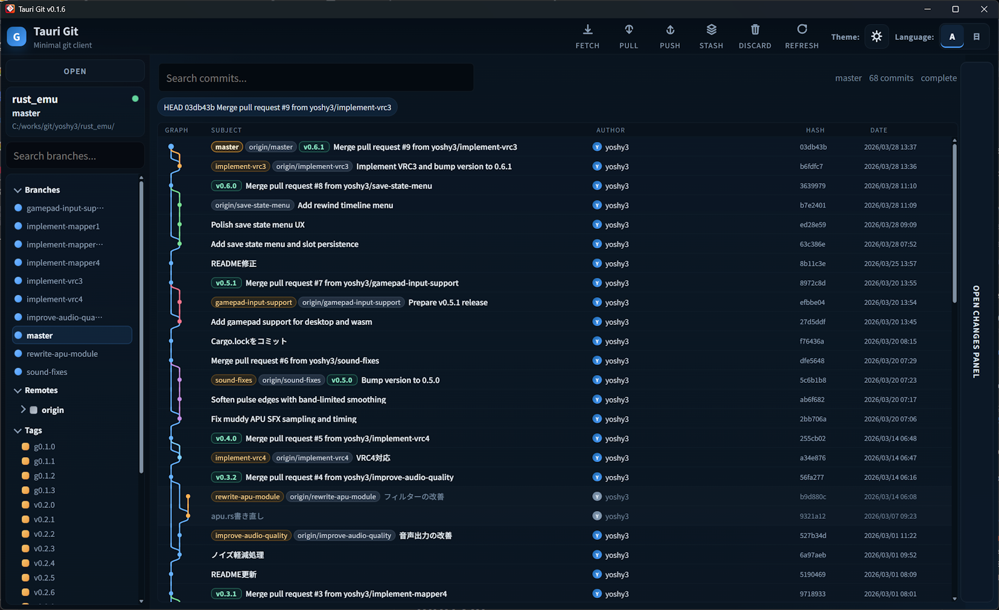

# Tauri Git

[English version](./README.md)

Tauri / Svelte / Rust で構成した、ミニマルな Git GUI です。

## 概要

Tauri Git は、日常的な Git 操作をコンパクトに扱うためのデスクトップアプリです。

- ローカル Git リポジトリを開く
- 作業ツリーの状態を確認する
- コミット履歴を閲覧する
- コミットを作成する
- stash を作成・適用・pop する
- Fetch / Pull / Push を実行する
- Pull / Push の未同期コミット数をトップバーと左ペインのローカルブランチ横に表示する
- ブランチとリモートをツリー表示で確認する
- タグを確認し、対応するコミットへ履歴から移動する
- ブランチの checkout / 作成 / rebase / reset / 削除を行う

## スクリーンショット



## 技術スタック

- フロントエンド: Svelte + Vite
- バックエンド: Tauri 2 + Rust
- Git 操作: `git2` と `git` コマンド実行
- 多言語対応: `svelte-i18n`

## 現在の主な機能

- リポジトリ選択と前回開いたリポジトリの復元
- ファイルや ref の変化を検知したときのオートリフレッシュ
- 作業ツリーの変更一覧表示
- ローカル / リモート / タグ ref ラベル付きのコミット履歴表示
- コミット履歴の検索とフィルタ
- サイドバーでのブランチ検索とフィルタ
- 左ペインのタグ選択に連動した、履歴コミットの選択とスクロール
- WebView ベースのタグ作成ダイアログ
- サイドバーメニューからのタグ削除
- タグ作成後の `origin` への optional push
- author / committer / refs / parents / changed files を含むコミット詳細表示
- コミット詳細から開ける2画面差分ダイアログ
- Changes Panel から開ける2画面差分ダイアログ
- コミット詳細とトップバーから開ける、`soft` / `mixed` / `hard` を選べる reset ダイアログ
- Changes Panel からのコミット作成
- stash の作成 / 適用 / pop
- 左ペインからの stash 選択と apply / pop
- `Fetch` / `Pull` / `Push` / `Refresh`
- `Pull` / `Push` の未同期コミット数をトップバーのバッジで表示
- 左ペインのローカルブランチ名の横に `Pull` / `Push` の未同期コミット数を表示
- `/` 区切りを階層として扱うローカル / リモートブランチツリー
- ローカル / リモートブランチからの checkout
- 作成後の自動切り替えに対応したブランチ作成ダイアログ
- 選択したローカル / リモートブランチへの rebase
- WebView ベースのブランチ削除ダイアログ
- 選択したコミットへの `soft` / `mixed` / `hard` reset
- リモートブランチ削除対応
- ブランチ名入力必須の安全な削除確認
- 未マージのローカルブランチ向け強制削除オプション
- 英語 / 日本語 UI 切り替え
- ダーク / ライトテーマ切り替えと設定の保存
- 左 / 中央 / 右ペイン幅のドラッグ変更
- ペイン幅の保存・復元
- ウィンドウサイズの保存・復元
- ウィンドウ位置の保存・復元（Wayland を除く）
- 起動時のウィンドウ復元時ちらつき対策（復元完了後に表示）

## リリース版の注意

### macOS

署名されていない、または notarization されていない macOS ビルドでは、Gatekeeper により「壊れているため開けません」のような警告が出ることがあります。

ダウンロードしたリリースを信頼できる場合は、`Tauri Git.app` を `Applications` に移動したうえで、quarantine 属性を外してください。

```bash
xattr -dr com.apple.quarantine "/Applications/Tauri Git.app"
```

その後、もう一度アプリを起動してください。

この手順は、信頼できるリリースに対してのみ行ってください。なお、それでも起動できない場合は、ダウンロードしたファイル自体が破損している可能性があります。

### Windows

Windows では、ダウンロードしたリリースの起動時に Microsoft Defender SmartScreen による「Windows によって PC が保護されました」という警告が表示されることがあります。

ダウンロードしたリリースを信頼できる場合は、次の手順で実行できます。

1. `詳細情報` をクリックする
2. 発行元やファイル名が、ダウンロードしたリリースと一致していることを確認する
3. `実行` または `実行する` をクリックする

この手順は、信頼できるリリースに対してのみ行ってください。出所が不明なファイルに対して警告が表示された場合は、実行せずにダウンロード元を確認してください。

## 開発

### 前提

- Node.js
- npm
- Rust toolchain
- 利用環境に応じた Tauri の前提ライブラリ
- `PATH` から参照できる Git

### 依存関係のインストール

```bash
npm install
```

### 開発版の起動

```bash
npm run tauri dev
```

### フロントエンドのビルド

```bash
npm run build
```

### 開発中に Windows の release 版を確認する方法

Windows の release 版をローカルで確認したい場合は、次を使ってください。

```bash
npm run tauri build
```

ビルド後は次の実行ファイルを起動します。

```powershell
.\src-tauri\target\release\tauri_git.exe
```

補足:

- release 動作の確認には `npm run tauri build` を使います。こちらはフロントエンドの成果物を Tauri アプリに正しく同梱します。
- `cargo build --release` は Rust 側の release コンパイル確認には使えますが、配布用に近いアプリ挙動の確認には向いていません。
- `cargo build --release` で生成した exe を直接起動すると、`http://localhost:1420` を開こうとして `ERR_CONNECTION_REFUSED` になることがあります。

## ディレクトリ構成

```text
src/        Svelte フロントエンド
src-tauri/  Tauri + Rust バックエンド
```

## 補足

- 一部の Git 操作は、一般的な Git ワークフローとの互換性を優先してシステムの `git` コマンドを利用しています。
- 現在は高機能な Git GUI の完全再現ではなく、日常用途に必要な最小構成を重視しています。
- 2画面差分ビューは、コミット詳細と Changes Panel の両方から利用できます。
- テーマ設定はローカルに保存され、次回起動時に復元されます。
- ペイン幅はローカルに保存され、次回起動時に復元されます。
- ウィンドウサイズは次回起動時に復元されます。ウィンドウ位置の復元は Linux の Wayland セッションでは制限されます。
- 通常のテキスト差分には対応しており、`git-crypt` 管理ファイルには compare view 用の専用フォールバックがあります。
- `git-crypt` 以外の独自 `diff` / `filter` / `textconv` 設定は、現時点では compare view で未対応です。対象によっては差分を表示できません。

## ライセンス

このプロジェクトは MIT License のもとで公開されています。詳細は [LICENSE](./LICENSE) を参照してください。
